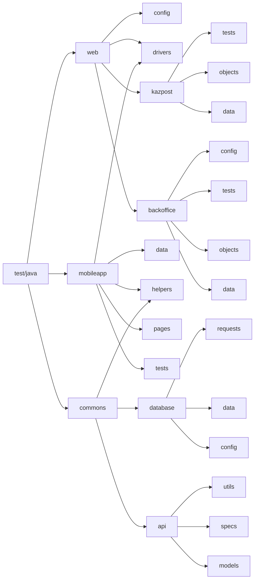

# Tabys tests: Mobile app + Kazpost + Backoffice
## Main recommendations

The majority of the mobile tests are written using xPath. That means that they are very sensitive to the app changes.
- Short term solution: use AppiumInspector and change the problematic selector's xPath
- Long term solution: Refactor the app and add good accessibility selectors

Configurations to run:
- Web tests:
  - Remotely
  - Locally
- Mobile tests:
  - Remotely
  - Locally
    - Emulator (browserstack closes the app automatically)
    - Physical device

## How to run and configure these tests

### Web tests

#### Remotely

##### Console

From the console, run the following script:

> gradle clean test -Dtask='навзвание_таска' -Dwebenv='remote'

##### Configurations

To change credentials for remote server, please change properties in the following file: src/test/resources/properties/auth/web-auth.properties
- Selenoid password
- Selenoid login
- Selenoid remote URL

To change the other configurations, please change properties in the following file: src/test/resources/properties/web/remote.properties
- Remote browser
- Browser version
  - The following browser + version combinations are available for remote tests:
    - Chrome 100.0, 99.0
    - Firefox 98.0, 97.0
    - Opera 85.0, 84.0
- Browser size
- Base URL

#### Locally

##### Console

From the console, run the following script:

> gradle clean test -Dwebenv='local'

##### Configurations

To change the other configurations, please change properties in the following file: src/test/resources/properties/web/local.properties
- Remote browser
- Browser version
  - The following browser + version combinations are available for remote tests:
    - Chrome 100.0, 99.0
    - Firefox 98.0, 97.0
    - Opera 85.0, 84.0
- Browser size
- Base URL

### Mobile tests

#### Locally

##### Physical device

###### Console

From the console, run the following script:

> gradle clean test -Dtask='навзвание_таска' -Dmobileeenv='physicaldevice'

###### Configurations
To change the other configurations, please change properties in the following file: src/test/resources/properties/mobile/physicaldevice.properties
- appPath - change if the name/path to the apk file changes
- serverUrl - not recommended to change
- appPackage = initial value: kz.tabys.test
- appActivity = initial value: kz.tabys.test.MainActivity 
- deviceName - change for each physical device (check the name of your device via cmd "adb driver")
- platformVersion - check your Android version

##### Emulator

###### Console

From the console, run the following script:

> gradle clean test -Dtask='навзвание_таска' -Dmobileeenv='emulator'

###### Configurations
To change the other configurations, please change properties in the following file: src/test/resources/properties/mobile/emulator.properties
- appPath - change if the name/path to the apk file changes
- serverUrl - not recommended to change
- appPackage = initial value: kz.tabys.test
- appActivity = initial value: kz.tabys.test.MainActivity
- deviceName - change for each emulator (see name in Android Studio device manager)
- platformVersion - check the version on Android Studio device manager

## Project structure

## How to change test data

All the test data are in the separate files in the following directory:

> src > test > java > mobileapp/commons/web > if you chose web, choose folder backoffice/kazpost > data

Please make sure to change these data once in a while to avoid pesticide effect.
In the future, these data might be reformatted to csv/json format.

## Troubleshooting

