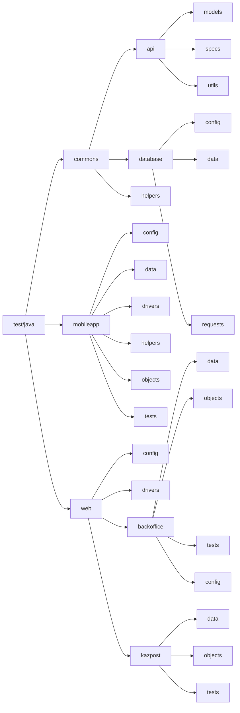

# Tabys tests: Mobile app + Kazpost + Backoffice
## Main recommendations

The majority of the mobile tests are written using xPath. That means that they are very sensitive to the app changes.
- Short term solution: use AppiumInspector and change the problematic selector's xPath
- Long term solution: Refactor the app and add good accessibility selectors

!!! Modal windows do not show up for appium. That's one of the reasons why we can't add a card/emulate a camera.

Configurations to run:
- Web tests:
  - Remotely
  - Locally
- Mobile tests:
  - Remotely
  - Locally
    - Emulator (browserstack closes the app automatically)
    - Physical device

## Major blockers

- Can't add a photo
- Can't add a card

## Tests included

### By purpose:

- Onboarding tests
  - Kazpost onboarding (up to the photo upload step)
  - Tabys onboarding (up to the photo upload step)
  - IPO onboarding (up to the photo upload step)
- Migration tests
  - Tabys -> IPO migration (up to the card upload step)
  - IPO -> Tabys migration (up to the card upload step)
  - Kazpost -> Tabys migration (up to the card upload step)
  - Kazpost -> IPO migration (up to the card upload step)

### By environment

- Mobile tests
  - Tabys onboarding (up to the photo upload step)
  - IPO onboarding (up to the photo upload step)
  - Tabys -> IPO migration (up to the card upload step)
  - IPO -> Tabys migration (up to the card upload step)
  - Kazpost -> Tabys migration (up to the card upload step)
  - Kazpost -> IPO migration (up to the card upload step)
- Web tests
  - Kazpost onboarding (up to the photo upload step)

## How to run and configure these tests

### Web tests

#### Remotely

##### Console

From the console, run the following script:

> gradle clean test -Dtask='навзвание_таска' -Dwebenv='remote'

##### Configurations

To change credentials for remote server, please change properties in the following file: src/test/resources/properties/auth/web-auth.properties
- Selenoid password
- Selenoid login
- Selenoid remote URL

To change the other configurations, please change properties in the following file: src/test/resources/properties/web/remote.properties
- Remote browser
- Browser version
  - The following browser + version combinations are available for remote tests:
    - Chrome 100.0, 99.0
    - Firefox 98.0, 97.0
    - Opera 85.0, 84.0
- Browser size
- Base URL

#### Locally

##### Console

From the console, run the following script:

> gradle clean test -Dwebenv='local'

##### Configurations

To change the other configurations, please change properties in the following file: src/test/resources/properties/web/local.properties
- Remote browser
- Browser version
  - The following browser + version combinations are available for remote tests:
    - Chrome 100.0, 99.0
    - Firefox 98.0, 97.0
    - Opera 85.0, 84.0
- Browser size
- Base URL

### Mobile tests

#### Locally

##### Physical device

###### Console

From the console, run the following script:

> gradle clean test -Dtask='навзвание_таска' -Dmobileeenv='physicaldevice'

###### Configurations
To change the other configurations, please change properties in the following file: src/test/resources/properties/mobile/physicaldevice.properties
- appPath - change if the name/path to the apk file changes
- serverUrl - not recommended to change
- appPackage = initial value: kz.tabys.test
- appActivity = initial value: kz.tabys.test.MainActivity 
- deviceName - change for each physical device (check the name of your device via cmd "adb driver")
- platformVersion - check your Android version

##### Emulator

###### Console

From the console, run the following script:

> gradle clean test -Dtask='навзвание_таска' -Dmobileeenv='emulator'

###### Configurations
To change the other configurations, please change properties in the following file: src/test/resources/properties/mobile/emulator.properties
- appPath - change if the name/path to the apk file changes
- serverUrl - not recommended to change
- appPackage = initial value: kz.tabys.test
- appActivity = initial value: kz.tabys.test.MainActivity
- deviceName - change for each emulator (see name in Android Studio device manager)
- platformVersion - check the version on Android Studio device manager

## Project structure

The project contains web tests, mobile tests, and the common block.

"common" block has necessary elements that are used in both web and mobile tests.
- **api** block has everything you need to refer to API: **models** (describing fields for API request body), **specs** (specifications for API requests and responses), and **utils** (contains API request body constructors - we will call these methods to make a body for API)
- **database** block is used to connect to project's databases. While **config** folder is temporarily not used, **data** block contains data to make a connection (security warning!!!), and **requests** methods describe connections themselves.
- **helpers** directory contains the files for report, and it isn't recommended to edit them
- Additionally, there are other utils classes in this folder that couldn't be connected to exclusively for web or mobile. For example, **OnboardingUtils.java** is in the **commons** folder, because these methods are used in both mobile onboarding and kazpost onboarding.

Each of the web and mobileapp directories have the same structure (web folder has some differences, which we will discuss below):
- .

## How to change test data

All the test data are in the separate files in the following directory:

> src > test > java > mobileapp/commons/web > if you chose web, choose folder backoffice/kazpost > data

On the flowchart, these folders are marked with orange color.

Please make sure to change these data once in a while to avoid pesticide effect.
In the future, these data might be reformatted to csv/json format.

## Troubleshooting

Many of these locators were not written properly due to the lack of good attributes. Therefore, a lot of these tests might fail if any of the onboarding processes are changed.

### If the test failed with the error "Element not found":
- Step 1: run the test locally on the physical device or emulator.
- Step 2: check if locators are still correct, as they might need an update.
  - Find the corresponding method in the "object" directory. Use error log or your IDE's debug mode.
  - In that method, find the problematic locator (the element that doesn't exist, or one of the previous element that caused malfunction)
  - Fix the problematic locator - see Appium documentation to see how to do it. To inspect the elements, I highly recommend to use Appium GUI together with Appium Inspector.
- Step 3. Check of there are unexpectedly long waiting time in one of the steps that is causing the test fail. In that case, I recommend to use Duration.ofSeconds in conditions of that element, or add Selenide.sleep.

## Further automation plan

- Fix modals issues and finish the already started tests.
- Refresh user's data in three processes (Can implement it)
- ETN purchase (Can implement it)
- IPO paper orders (Warning: there should be available IPO papers)
- Account deletion with a fresh account (blocked because registration can't be completed)